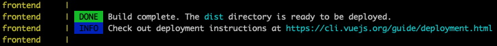

# Installation

## 1. Get Docker ready

To build Tutti environment, you first need to install **Docker** and **Docker Compose** in your host server.  
Since their installation steps may depend on your local environment, please follow their latest official installation procedures.

- [Install Docker](https://docs.docker.com/get-docker/)
- [Install Docker Compose](https://docs.docker.com/compose/install/)

## 2. Clone Tutti repository

```
git clone https://github.com/iflb/tutti
```

## 3. Initial Configuration for Tutti

### 3-1. Host settings

There are two hosts used in Tutti: for **production** and **development**.

- **Production host** ... Can be distributed to external workers. <span style="color:red">Manual build is necessary</span> before publishing.
- **Development host** ... Used for prototyping Tutti projects. Changes in projects are monitored and automatically rebuilt.

#### 3-1-1. Production host

<u>By default, the production host can be accessed from `http://localhost:80/`.</u>

To change settings for production, edit `tutti/.env` file as follows:

**Ex.**, changing to http://mytuttidomain.com:8880/ :

```diff
- DOMAIN_NAME=localhost
- HTTP_PORT=80
===
+ DOMAIN_NAME=mytuttidomain.com
+ HTTP_PORT=8880
```

#### 3-1-2. Development host

<u>By default, the development host can be accessed from `http://localhost:8080/`.</u>

Likewise, change development host settings as follows, if necessary.

**Ex 1.**, changing to http://mytuttidomain.com:8881/ :

```diff
- DEV_DOMAIN_NAME=localhost
- DEV_HTTP_PORT=8080
===
+ DEV_DOMAIN_NAME=mytuttidomain.com
+ DEV_HTTP_PORT=8881
```

**Ex 2.**, changing to http://dev.mytuttidomain.com/ :

```diff
- DEV_DOMAIN_NAME=localhost
- DEV_HTTP_PORT=8080
===
+ DEV_DOMAIN_NAME=dev.mytuttidomain.com
+ DEV_HTTP_PORT=80
```

?> Make sure to open port numbers as necessary.

### 3-2. SSL settings

If you have set your own domain name (not `localhost`) above, Tutti can obtain, set up, and renew SSL certificates via [Let's Encrypt](https://letsencrypt.org) for you -- so that you can serve your tasks via HTTPS.

Edit `tutti/.env` like:

```diff
- ENABLE_SSL=0
- EMAIL=

- DEV_ENABLE_SSL=0
- DEV_EMAIL=
===
+ ENABLE_SSL=1
+ EMAIL=my.email.address@for.letsencrypt.contact.info.com

+ DEV_ENABLE_SSL=1
+ DEV_EMAIL=my.email.address@for.letsencrypt.contact.info.com
```

?> Make sure to open port 443.

## 4. Launch Tutti

### Initialize

At `~/tutti/`, run the command below. This sets up file/command permissions and env variables necessary to Tutti functionality.

```
./tutti init
```

?> This only needs to be called once when launching Tutti envrionment, and has no effect on further execution.

### Build

Then run the command below (this may take at least a few minutes)

```
./tutti build
```

### Start

Then run the command below (this may take another few minutes)

```
./tutti start
```

and wait until the service starts up. Monitor its status with:

```
./tutti log frontend-dev
```

When the service is up, you will see messages like below:



Hit Ctrl-C to abort the log output.

## 5. Check Tutti Console

Access in your web browser:

- `https://<dev-domain>/` (if service is running on HTTPS)
- `http://<dev-domain>:<dev-port>/` (on HTTP)

Then you should see Tutti's Web Console like this:


**That's it!** You are now ready to start developing your annotation project with Tutti.
